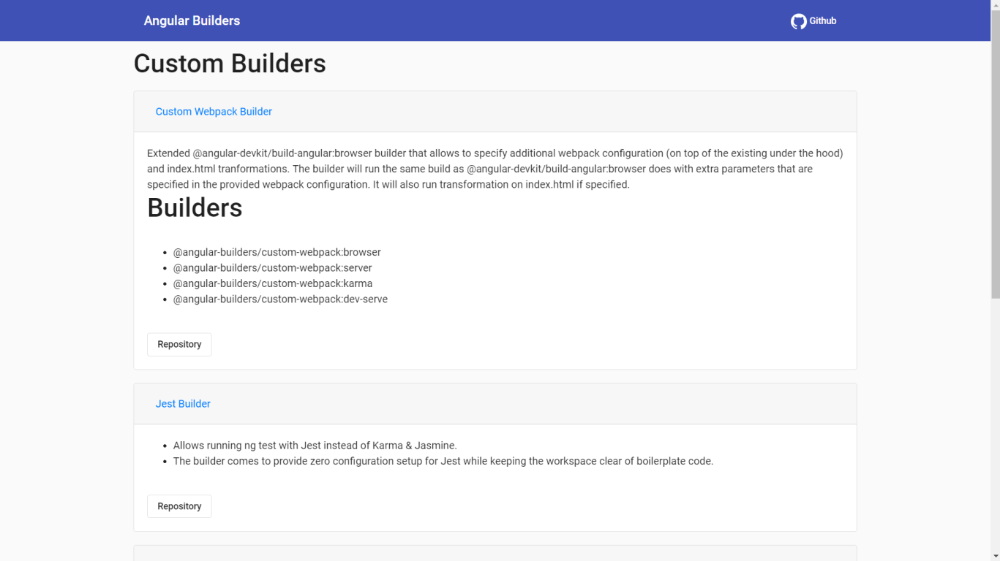

# Angular Builders
[](#contributors-)



Click [here](https://angular-builders.dev) to see list of builders.

This project was generated with [Angular CLI](https://github.com/angular/angular-cli) version 8.0.3.

## Adding a new builder

1. Find the `buidlers.json` in `assets` folder.
2. Provide the data for new builder in below `json` format

```json
{
    "name": "Bazel Build",
    "description": "Bazel is an open-source build and test tool similar to Make, Maven, and Gradle. It uses a human-readable, high-level build language. Bazel supports projects in multiple languages and builds outputs for multiple platforms. Bazel supports large codebases across multiple repositories, and large numbers of users.",
    "repository": "https://github.com/bazelbuild/bazel"
  }
```

## Development server

Run `ng serve` for a dev server. Navigate to `http://localhost:4200/`. The app will automatically reload if you change any of the source files.


## Become a contributor

#### Missing a builder, found bug or typo in docs?

Please, feel free to open an [issue](https://github.com/santoshyadav198613/angular-builder/issues)
or submit a [pull request](https://github.com/santoshyadav198613/angular-builder/pulls) to make this project better for everyone!

## Contributors ✨

Thanks goes to these wonderful people ([emoji key](https://allcontributors.org/docs/en/emoji-key)):

<!-- ALL-CONTRIBUTORS-LIST:START - Do not remove or modify this section -->
<!-- prettier-ignore -->
<table>
  <tr>
    <td align="center"><a href="http://santoshyadavblog.com"><br /><sub><b>Santosh Yadav</b></sub></a><br /><a href="https://github.com/ngx-builders/angular-builder/commits?author=santoshyadav198613" title="Code">💻</a> <a href="#content-santoshyadav198613" title="Content">🖋</a> <a href="#design-santoshyadav198613" title="Design">🎨</a> <a href="https://github.com/ngx-builders/angular-builder/commits?author=santoshyadav198613" title="Documentation">📖</a></td>
    <td align="center"><a href="https://www.youtube.com/c/NitishKumarSingh"><br /><sub><b>Nitish Kumar Singh</b></sub></a><br /><a href="https://github.com/ngx-builders/angular-builder/commits?author=nitishk72" title="Code">💻</a> <a href="#design-nitishk72" title="Design">🎨</a></td>
    <td align="center"><a href="https://github.com/patel"><br /><sub><b>Krunal Patel</b></sub></a><br /><a href="https://github.com/ngx-builders/angular-builder/commits?author=patel" title="Code">💻</a></td>
  </tr>
</table>

<!-- ALL-CONTRIBUTORS-LIST:END -->

This project follows the [all-contributors](https://github.com/all-contributors/all-contributors) specification. Contributions of any kind welcome!
